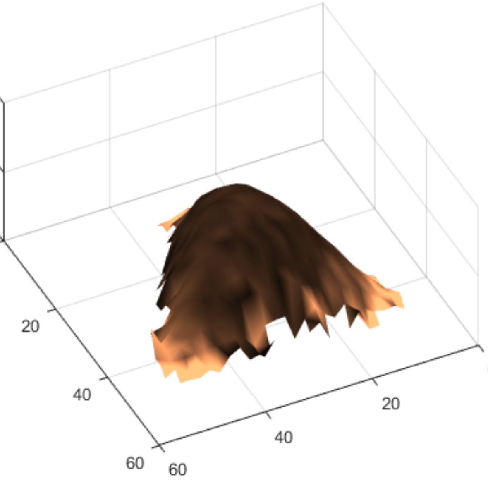

# CellMAP

<p align="center">
  
</p>

<p align="center">
  <b>Open-source software for batch processing AFM cell topography and elasticity maps</b>
</p>

<p align="center">
  
  
  
  
</p>

---

## Overview

CellMAP is an open-source software designed to batch-process **atomic force microscopy (AFM)** datasets, including:

* Cell topography maps
* Elasticity (Young’s modulus) maps
* Force-indentation curves

It provides an intuitive graphical interface to:

* visualize AFM maps
* inspect force curves
* apply processing pipelines
* compare multiple cells or experimental conditions
* export processed datasets

CellMAP was developed for AFM datasets acquired using **Nanowizard AFM (JPK-Bruker)**.

---

## Citation

If you use CellMAP in your research, please cite:

Allard, A., Liboz, M., Crépin, R. *et al.*
**CellMAP: an open-source software tool to batch-process cell topography and stiffness maps collected with an atomic force microscope**
*BMC Bioinformatics* **26**, 38 (2025)
DOI: https://doi.org/10.1186/s12859-025-06060-0

---

# Features

✅ Batch processing of multiple cells
✅ AFM map visualization
✅ Histogram analysis
✅ ROI-based statistics
✅ Force curve loading and visualization
✅ Pipeline recording and replay
✅ Export to `.txt` and session files
✅ Compatible with JPK Data Processing exports

---

# Installation

## Option 1 — MATLAB App (Recommended for MATLAB users)

Requirements:

* MATLAB **R2020b or newer**

Installation:

1. Open MATLAB
2. Go to **Apps**
3. Click **Install App**
4. Select:

```text
release/CellMAP.mltbx
```

---

## Option 2 — Standalone Executable (No MATLAB license required)

Requirements:

* Windows
* MATLAB Runtime **R2021b (9.11)**

Install MATLAB Runtime from:

https://www.mathworks.com/products/compiler/mcr/index.html

Then run:

```text
release/build/CellMAP.exe
```

---

# Quick Start

## 1. Organize your dataset

Structure your folders as follows:

```text
Dataset/
├── Cell_1/
│   ├── map1.txt
│   └── forces.jpk-qi-data
│
├── Cell_2/
│   ├── map2.txt
│   └── forces.jpk-qi-data
```

Each subfolder corresponds to:

* one cell
  or
* one experimental object

---

## 2. Required metadata in `.txt`

Each map file must include at least:

```txt
# channel:
# start date:
```

Example:

```txt
# channel: [3] Contact Point
# start date: Wed Nov 12 12:38:46 CET 2025
```

If force curves are provided, the **start date must match**.

---

## 3. Start a session

In CellMAP:

**File → New Session**

Select the master dataset folder.

CellMAP automatically loads:

* all subfolders
* AFM maps
* optional force curves

---

# Main Interface

The GUI contains several panels:

## Parameters

Select:

* Cell number
* Data type
* Processing stage

Examples of data types:

* Contact Point
* Young Modulus
* Indentation

---

## Mapping

Display 2D AFM maps with adjustable:

* color scale
* min/max limits
* spatial inspection

---

## Distribution

Histogram visualization with configurable:

* bin width
* limits
* normalization (`pdf`, `cdf`, etc.)

---

## Statistics

Provides:

* mean
* median
* standard deviation
* ROI statistics

---

## ROI Manager

ROI tools allow:

* selecting regions of interest
* computing local statistics
* comparing cell subregions

---

# Force Curve Analysis

When force curves are loaded, CellMAP can display:

* force-indentation curves
* local indentation
* spatially linked force measurements

Additional tools:

* inspect individual datapoints
* delete bad datapoints
* locate histogram bins on map

---

# Export Options

CellMAP supports:

## Session Export

Save current workflow:

```text
.dat
```

Reload later with:

```text
File → Load Session
```

---

## Pipeline Recording

Record all processing operations.

Useful for:

* reproducibility
* batch automation
* standardized analysis

---

## Data Export

Export processed data as:

```text
.txt
```

Compatible with external analysis tools.

---

# Performance Tips

For faster loading of force curves, install:

* 7-Zip
* or another external unzip utility

This can accelerate extraction by approximately **3×** compared to MATLAB’s internal unzip.

---

# Known Issues

* Force curve loading for some `(n,m)` datasets still requires validation.

---

# Changelog

## v1.2 (2026-06-22)

* Added ROI Manager

## v1.1

* Added ROI statistics
* Improved histogram display
* Fixed force loading issues

## v1.0

Initial release

---

# Contact

**Antoine Allard**
Université de Bordeaux
Email: [antoine.allard@u-bordeaux.fr](mailto:antoine.allard@u-bordeaux.fr)
